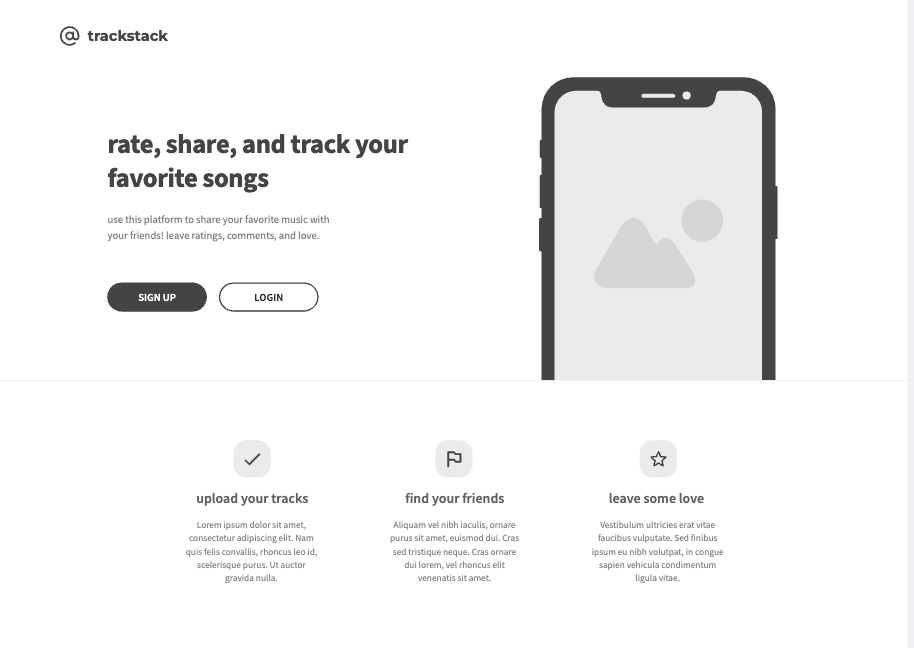
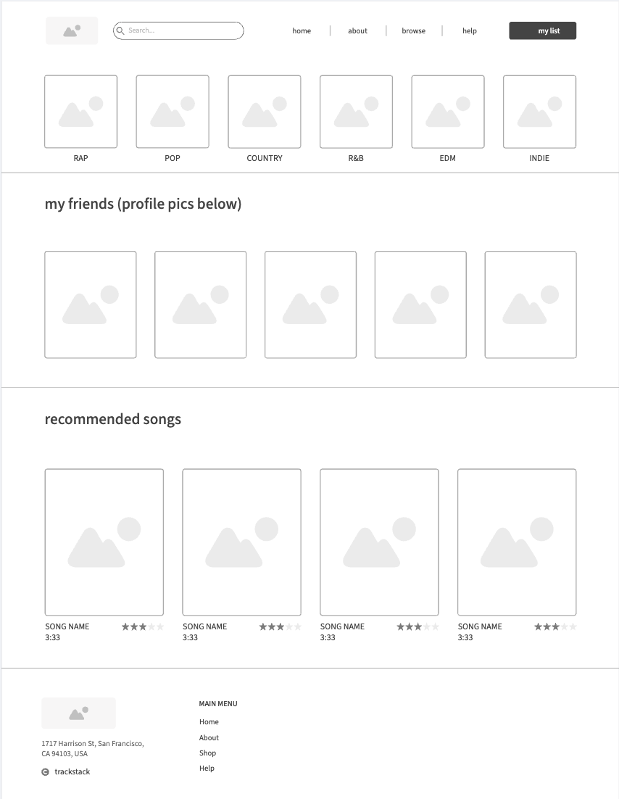
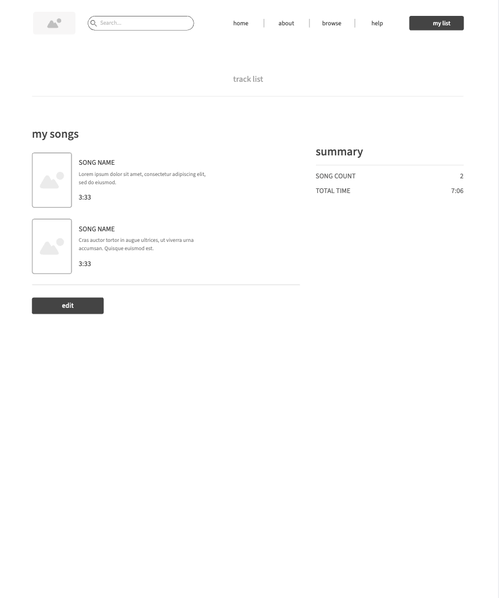
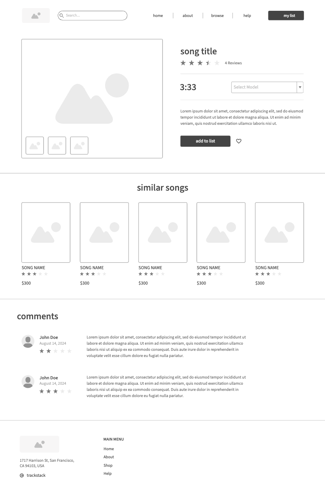

# TrackStack: Song Tracker
Presley Roldan
CS 408 Final

## Project Overview

TrackStack is a full-stack web application that allows users to create, manage, and explore their personal collection of songs. The app is designed to help music lovers log their favorite tracks, tag them by genre or mood, leave personal notes, and organize their music library in a meaningful way. Whether you're a casual listener or a dedicated audiophile, TrackStack offers a simple, elegant way to track what you're listening to and why it matters to you.

This project is being developed as a final project for the CS408 Web Development course. It is fully compliant with the A-level requirements, including the use of AWS for backend data storage, multiple distinct pages, dynamic data handling, input sanitization, high accessibility standards, and thorough JavaScript test coverage.

---

## Theme

The theme of the project centers around **music cataloging and personal reflection**. Users are encouraged to use TrackStack as a way to curate their song library—not just by listing titles, but by engaging with them: adding ratings, moods, notes, and tags that reflect their musical journey.

This should be a music journal!

---

## What It Does

TrackStack enables users to:

- Add songs to their collection using a form
- Include details such as artist, album, genre, mood, and a personal note
- Rate each song on a 5-star scale
- View all added songs in a sortable, filterable list
- Click on individual songs to view details, edit them, or delete them
- Search or filter songs based on genre, mood, or artist
- Optionally embed links to previews from Spotify or YouTube

All interactions that involve creating, retrieving, updating, or deleting data are powered by an AWS backend, using Lambda functions and DynamoDB (or an S3-based solution, depending on final architecture).

---

## Target Audience

TrackStack is aimed at:

- Music enthusiasts who want to document their listening habits
- People who enjoy curating playlists or tracking media
- Users who prefer a personal, customizable system over streaming platforms' built-in libraries
- Students or creatives who draw inspiration from music and want to log it

The application is intentionally designed to be simple and intuitive so that anyone, regardless of technical ability, can interact with it easily.

---

## Data Model

The main dynamic data handled by TrackStack includes:

- **Song Title**: Required, string
- **Artist**: Required, string
- **Album**: Optional, string
- **Genre**: Optional, string (dropdown or text input)
- **Mood Tags**: Optional, comma-separated list
- **Notes**: Optional, multiline text
- **Rating**: Optional, 0–5 stars
- **Preview Link**: Optional, validated URL (YouTube/Spotify)
- **Timestamp**: Automatically added on entry creation

This data is collected from user input through forms and sanitized both client-side and server-side.

---

## Pages

TrackStack will have **4+ distinct HTML pages**:

1. **Landing Page**
   - Welcome message, project summary, login
    

2. **Browse Page**
   - View your friends updates
   - View rewiews
   

3. **Tracklist Page**
   - Table/grid view of all entries
   - Filter and sort features
    

4. **Song Detail Page**
   - Full info for one entry
   - Option to edit or delete
      

Additional potential pages:
- **Search Page**
- **About Page / Credits**
- **Export JSON**

---

## Stretch Goals

To make TrackStack even better, here are optional features I'd like to implement:

- **User Accounts/Login** (to support multiple collections)
- **Dark Mode toggle**
- **CSV/JSON Export** of a user’s collection
- **Spotify or YouTube embed support** for each song entry
- **"Now Playing" mini player**
- **Simple recommendation engine** based on tags or ratings
- **Mobile-first responsive design**

---

## Tech Stack

- **Frontend**: HTML, CSS (custom styles), vanilla JavaScript
- **Backend**: AWS Lambda, API Gateway, DynamoDB or S3
- **Hosting**: AWS S3 Static Website Hosting
- **Testing**: Jest for JavaScript logic (especially input validation and rendering functions)
- **Accessibility**: Follows best practices to ensure all pages get a perfect Lighthouse accessibility score
- **Wireframes**: Created using [Moqups](https://moqups.com)

---
